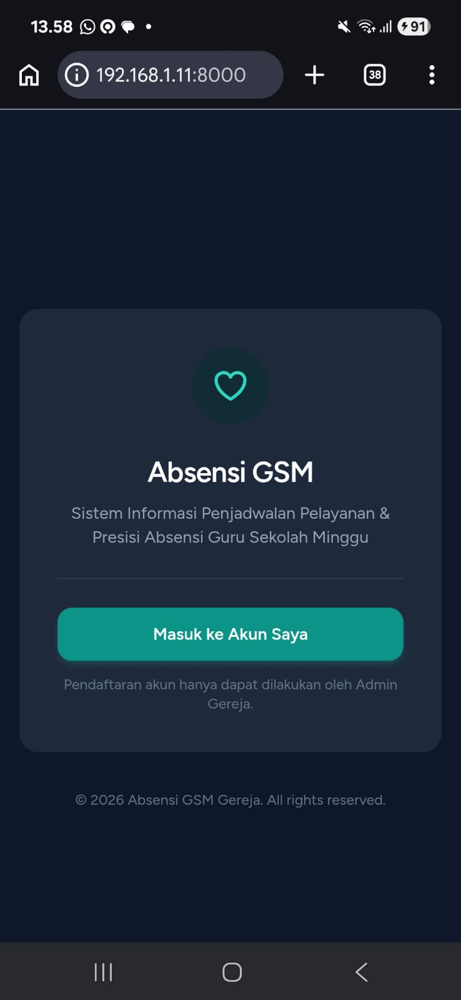
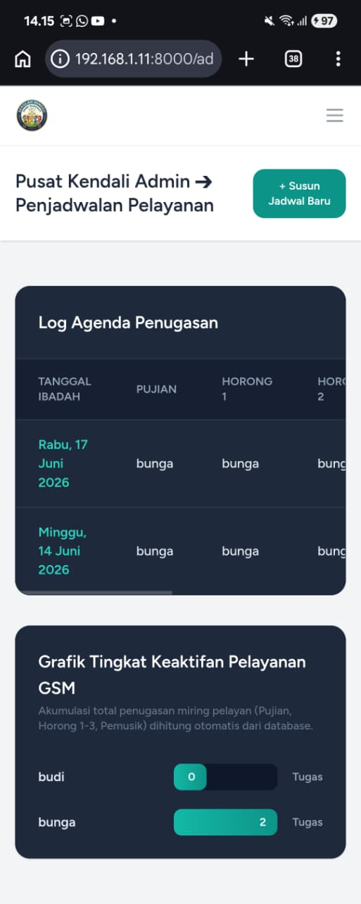
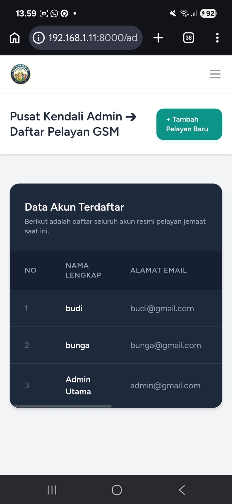
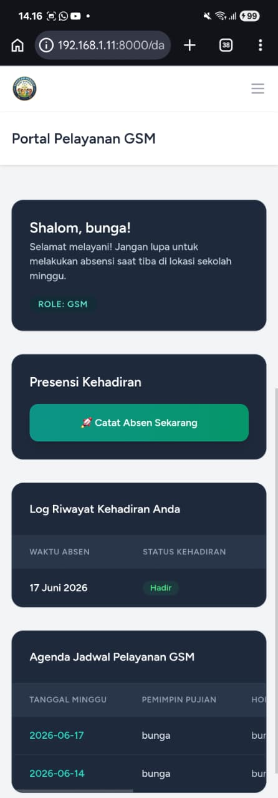

<h1>Portal Absensi & Agenda GSM (Guru Sekolah Minggu)</h1>

<p align="center">
  
  
  
  
  
</p>

An advanced, mobile-responsive Web Application built to optimize administrative workflows for Sunday School Ministries. This system replaces conventional, manual tracking by introducing an automated solution combining secure **Geofencing & Biometric (Selfie-Attachment) Attendance Validation** with centralized schedule management.

Developed with a modern monolithic stack using **Laravel, Inertia.js, and React**, this application delivers with structural enterprise backend stability.

---

## <h3>🚀 Target Users & Role Privileges</h3>

The system architecture cleanly separates responsibilities into **two distinct user roles** to streamline ministry management:

### 1. Admin (Administrator Panel)
* **Account Management:** Full control over creating, updating, and managing user accounts for Sunday School teachers (GSM).
* **Schedule Coordination:** Responsible for creating, structuring, and organizing the ministry calendars, service timeframes, and class agendas.
* **Attendance Oversight:** Monitors all incoming attendance records submitted by teachers in real-time for compliance and analytical reporting.

### 2. GSM (Guru Sekolah Minggu / Sunday School Teacher)
* **Schedule Access:** Authorized to view centralized schedules and specific class agendas curated by the Admin.
* **Single-Point Attendance Submission:** Enforces attendance logging strictly for service presence confirmation (Single Presence Token per scheduled service; no check-out/leaving logs required).
* **Location & Identity Proof:** Requires real-time native device camera attachment (selfie photo) and current hardware GPS coordinate mapping.

---

## <h3>🔒 Key Engineering Features</h3>

### 1. Precision Geofencing Engine
* Employs the mathematical **Haversine Formula** calculated server-side to resolve exact real-time physical distances between the GSM device's captured GPS tokens and the configured target venue (e.g., Church or Ministry base coordinates).
* Restricts presence spoofing by rejecting coordinates outside the pre-configured boundary radius (e.g., 100 meters) natively defined in the ecosystem configuration.

### 2. Biometric Integrity Validation
* Integrates native device camera modules within the React interface wrapper, capturing an instantaneous identification photo directly on submission.
* Prevents data manipulation by bundling the image asset, live latitude/longitude variables, and synchronized backend timestamps into a single atomic database payload.

---

## <h3>📸 Project Showcase</h3>

*The application provides an intuitive User Interface tailored for mobile views (`Samsung Galaxy A16`) and desktop monitoring:*

<p align="center">
  
  
  
  
  
  
    
</p>

---

## <h3>🛠️ Built With (Tech Stack)</h3>

* **Backend Core:** Laravel 11 (MVC architecture, secure routing layers, configuration management)
* **Frontend Ecosystem:** React.js (Component-driven view states, reactive user interfaces)
* **Monolithic Middleware:** Inertia.js (Eliminates the layer complexity of separate REST API endpoints; bridges backend states directly to React props)
* **Database Driver:** SQLite (High-performance, transactional, single-file serverless storage engine optimized for agile deployment structures)
* **Styling Engine:** Tailwind CSS (Utility-first responsive design mapping)

---

## <h3>📐 Database Architecture Schema</h3>

The relational database is explicitly built to handle transactional presence records and schedule structures efficiently across the following primary tables:

* **`users`**: Contains account identification, login credentials, profiles, and role separation attributes (`admin` vs `gsm`).
* **`schedules`**: Holds administrative ministry timeframes, specific lesson dates, and agenda details prepared by the Admin.
* **`attendances`**: Records transaksional GSM presence confirmations, capturing `user_id`, mapping `latitude` and `longitude` fields, storing file pointers for the verified selfie attachment, and locking the precise verification timestamp.

---

## <h3>💻 Local Installation & Setup Guide</h3>

Follow this step-by-step technical guide to initialize, configure, and launch the application in your local development workspace:

### Prerequisites
Ensure your laptop has the following environment tooling installed:
* PHP >= 8.2
* Composer
* Node.js (version 18+ recommended) & NPM

### Setup Execution Workflow

1. **Clone the Source Repository**
   ```bash
   git clone [https://github.com/your-username/gsm-attendance-system.git](https://github.com/your-username/gsm-attendance-system.git)
   cd gsm-attendance-system
   
2. **Install Application Dependencies**
   Run the package installations for both backend PHP classes and frontend JavaScript modules:
      ```bash
   composer install
    npm install
      
3. **Configure Environment Parameters**
   Duplicate the template environment file to create your active configuration layer:
      ```bash
   cp .env.example .env
     ```
    Open the .env file in your editor (e.g., VS Code) and update the database settings alongside        your target geofencing coordinates (e.g., your current home base or kos coordinates):
   ```bash
   APP_ENV=local
    APP_KEY=
    APP_URL=[http://127.0.0.1:8000](http://127.0.0.1:8000)

    # Database Engine Configuration
    DB_CONNECTION=sqlite

    # Geofencing Parameters (Target Reference Point)
    KOS_LATITUDE=-7.332845
    KOS_LONGITUDE=112.729541
    GEOFENCE_RADIUS=100
     ```
    Note: Generate a secure application key after setting up the environment file:
    ```bash
   php artisan key:generate
    
4. **Initialize the SQLite Database**
   Create a physical, empty database file matching the Laravel SQLite expectation, then seed structural data:
   ```bash
   php artisan migrate:fresh --seed
   
5. **Expose and Launch Servers for Mobile Testing**
   To access and test this system using a physical smartphone (e.g., your Samsung Galaxy A16) on the same local Wi-Fi connection, execute both processes in independent terminal tabs:

   **Terminal Tab 1 (Frontend Vite Compiler):**
   ```bash
    npm run dev
    ```
   **Terminal Tab 2 (Laravel Framework Server Binding):**
      ```bash
    php artisan serve --host=0.0.0.0
     ```

